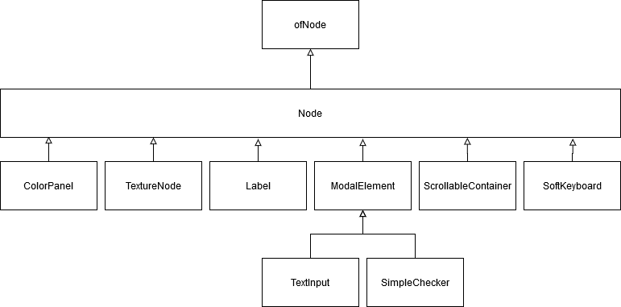

# ofxInterface - components

## Properties

### Node

The base element.

| property      | type          | description  |
| ------------- |---------------| -----|
| id            | string        | unique identifier (should always be set) |
| position      | ofVec2f       | position in px|
| size          | ofVec2f       | size in px |
| plane         | float         | the bigger the more in front (default 10) |
| renderClip    | bool          | clip element parts out of element size |
| active        | bool          | set element visible and enabled |

### ModalElement

Element that describes buttons, checkers and radios.

Inherits from Node.

| property      | type          | description  |
| ------------- |---------------| -----|
| type          | string        | ether "button","checker" or "radio" |
| colorActive   | ofColor       | color for activated state|
| colorInactive | ofColor       | color for inactive state|
| colorSelected | ofColor       | color for selected state|

### TextInput

An editable Text.

Inherits from ModalElement.

| property      | type          | description  |
| ------------- |---------------| -----|
| font          | string        | id of the font |
| maxChars      | int           | maximum length of input|
| description   | string        | text when line empty|

### SimpleChecker

A simple checkbox ;) -

Inherits from ModalElement.

### ColorPanel

A colored panel

Inherits from Node.

| property      | type          | description  |
| ------------- |---------------| -----|
| strokeWidth   | float         | stroke width  |
| borderRadius  | float         | border radius |
| color         | ofColor       | panel color |
| strokeColor   | ofColor       | border color |

### TextureNode

A Node that displays a texture

Inherits from Node.

| property      | type          | description  |
| ------------- |---------------| -----|
| texture   | string         | texture id  |
| tint  | string         | texture tinting (color id is set)|
| blendmode         | string       | "alpha","none","add","multiply","screen" and "subract" allowed |
| strokeColor   | ofColor       | border color |

### Label

A short text

Inherits from Node.

| property      | type          | description  |
| ------------- |---------------| -----|
| font          | string        | id of the font |
| text      | string           | text to be drawn|
| alignment   | string        | "left","center" or "right"|
| shadow   | object        | activate dropshadow|

#### shadow parameters
| property      | type          | description  |
| ------------- |---------------| -----|
| size          | float         | shadow size (bigger is blurrier)|
| x             | float         | x-offset|
| y             | float         | y-offset|
| color         | ofColor       | shadow color |

### ScrollableContainer

A container to contain elements bigger than screen size.

Inherits from Node.

| property      | type          | description  |
| ------------- |---------------| -----|
| sizeScrollableArea          | ofVec2f        | the scrollable area size |
| bgColor      | ofColor           | background color|
| scrollActiveColor   | ofColor        | scrollbar color when selected|
| scrollInactiveColor   | ofColor        | scrollbar color when not selected|

### SoftKeyboard

An on-screen keyboard.

Inherits from Node. Height of Element depends on width and is automatically set.

| property      | type          | description  |
| ------------- |---------------| -----|
| font          | string        | id of the font |
| bgColor       | ofColor       | background color|
| colorActive   | ofColor       | key background color when enabled|
| colorInactive | ofColor       | key background color when disabled|
| colorSelected | ofColor       | key background color when selected|
| borderRadius  | float         | border radius (also effects keys)|
| borderWidth   | float         | border width (also effects keys)|
| margin        | float         | space between border and keys|
| padding       | float         | space between keys|

### TextureNode

A simple Slider.

Inherits from Node.

| property      | type          | description  |
| ------------- |---------------| -----|
| direction     | string         | "horizontal", "vertical" |
| colorActive   | ofColor       | key background color when enabled|
| colorInactive | ofColor       | key background color when disabled|
| colorSelected | ofColor       | key background color when selected|
| colorSelected | ofColor       | key background color when selected|
| lineWidth     | int           | thickness of the bar|